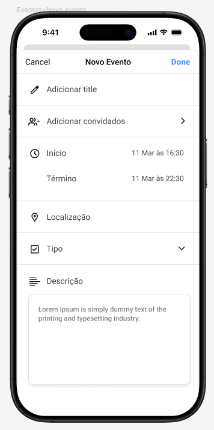

# Reside

**Gabriel Ramos Ferreira**

**João Pedro Silva Braga**

**João Vitor Romero Sales**

**Lucas Randazzo**

**Lúcio Alves Almeida Neto**

---

Professores:

**Artur Martins Mol**

**Leonardo Vilela Cardoso**

---

_Curso de Engenharia de Software, Unidade Coração Eucarístico_

_Instituto de Informática e Ciências Exatas – Pontifícia Universidade de Minas Gerais (PUC MINAS), Belo Horizonte – MG – Brasil_

---

_**Resumo**. 
O projeto visa desenvolver um sistema de gestão de condomínios, integrando síndicos, moradores e prestadores de serviço. Contará com autenticação segura via e-mail e senha, além de recuperação de credenciais. Diferentes perfis de usuários terão permissões específicas, permitindo que síndicos administrem moradores e prestadores se cadastrem de forma independente.

A plataforma permitirá o agendamento de áreas comuns, evitando conflitos e enviando notificações automáticas. Moradores poderão registrar ocorrências, e síndicos gerenciá-las. Um feed de comunicação permitirá postagens e interações com moderação. Notificações push alertarão sobre eventos importantes, e um sistema de mensagens possibilitará comunicação em tempo real. A infraestrutura usará PostgreSQL, garantindo segurança, alta disponibilidade e recuperação automática de falhas.

---

## Histórico de Revisões

| **Data**   | **Autor(es)**                                              | **Descrição**                                                                                                                                                                                                                                                           | **Versão** |
| :--------- | :--------------------------------------------------------- | :---------------------------------------------------------------------------------------------------------------------------------------------------------------------------------------------------------------------------------------------------------------------- | :--------- |
| 18/03/2025 | Gabriel Ramos, João P. Silva, João V. Romero, Lúcio Alves, Lucas Randazzo | Criação inicial do Documento de Arquitetura. Definição da Seção 1 (Apresentação - Problema, Objetivos), Seção 2 (Nosso Produto - Visão, Produto, Personas Iniciais) e Seção 3 (Requisitos - Requisitos Funcionais Iniciais, Requisitos Não-Funcionais Iniciais). | 1.0        |
| 25/03/2025 | Gabriel Ramos, João P. Silva, João V. Romero, Lúcio Alves, Lucas Randazzo | Atualização das Seções 1, 2 e 3 com base no feedback da Sprint 2, Semana 1. Refinamento das personas e detalhamento inicial de alguns requisitos funcionais e não-funcionais. Inclusão da subseção 1.3 (Definições e Abreviaturas - inicial).                      | 1.1        |
| 13/04/2025 | Gabriel Ramos, João P. Silva, João V. Romero, Lúcio Alves, Lucas Randazzo | Versão final das Seções 1, 2 e 3. Conclusão da subseção 1.3. Adição da Seção 3.3 (Restrições Arquiteturais) e 3.4 (Mecanismos Arquiteturais - versão inicial). Introdução da Seção 4 (Modelagem - Visão de Negócio inicial com funcionalidades e Histórias de Usuário). | 2.0        |
| 11/05/2025 | Gabriel Ramos, João P. Silva, João V. Romero, Lúcio Alves, Lucas Randazzo | Atualização da Seção 4: Adição da Visão Lógica (Diagrama de Classes e Diagrama de Componentes iniciais) e Modelo de Dados (Diagrama ER inicial). Atualização da Seção 3.4 (Mecanismos Arquiteturais) com base na prototipação da Sprint 3. Adição da Seção 5 (Wireframes - link/referência). | 2.5        |
| 28/05/2025 | Gabriel Ramos, João P. Silva, João V. Romero, Lúcio Alves, Lucas Randazzo | Refinamento dos diagramas na Seção 4 (Classes, Componentes, ER) com base na implementação das funcionalidades prioritárias. Atualização da Seção 3 (Requisitos) para refletir o status das funcionalidades da Sprint 4. Adição da Seção 6 (Projeto da Solução - link para Figma). | 3.0        |
| 04/06/2025 | Gabriel Ramos, João P. Silva, João V. Romero, Lúcio Alves, Lucas Randazzo | Atualização da Seção 4 (Modelagem) e Seção 3 (Requisitos) com base na implementação das funcionalidades desejáveis da Sprint 5. Início da Seção 9.1 (Ferramentas).                                                                                                       | 3.5        |
| 11/06/2025 | Gabriel Ramos, João P. Silva, João V. Romero, Lúcio Alves, Lucas Randazzo | Início da elaboração da Seção 7 (Avaliação da Arquitetura), com a definição inicial dos Cenários de teste (7.1) e estrutura da Avaliação (7.2), baseada no método ATAM. Atualizações gerais com base no refinamento do código.                                       | 4.0        |
| 18/06/2025 | Gabriel Ramos, João P. Silva, João V. Romero, Lúcio Alves, Lucas Randazzo | Detalhamento e correção dos Cenários de Teste (Seção 7.1). Início da documentação da avaliação para os primeiros cenários (Seção 7.2), com base nos testes das funcionalidades desejáveis.                                                                           | 4.1        |
| 25/06/2025 | Gabriel Ramos, João P. Silva, João V. Romero, Lúcio Alves, Lucas Randazzo | **Versão Final Completa.** Todas as seções revisadas e atualizadas para refletir o estado final do projeto. Conclusão da Seção 7 (Avaliação da Arquitetura) com todas as evidências e considerações. Preenchimento da Seção 8 (Referências) e Seção 9 (Apêndices). | 5.0        |

## SUMÁRIO

1. [Apresentação](#apresentacao "Apresentação")  
	1.1. Problema  
	1.2. Objetivos do trabalho  
	1.3. Definições e Abreviaturas  
 
2. [Nosso Produto](#produto "Nosso Produto")  
	2.1. Visão do Produto  
   	2.2. Nosso Produto  
   	2.3. Personas  

3. [Requisitos](#requisitos "Requisitos")  
	3.1. Requisitos Funcionais  
	3.2. Requisitos Não-Funcionais  
	3.3. Restrições Arquiteturais  
	3.4. Mecanismos Arquiteturais  

4. [Modelagem](#modelagem "Modelagem e projeto arquitetural")  
	4.1. Visão de Negócio  
	4.2. Visão Lógica  
	4.3. Modelo de dados (opcional)  

5. [Wireframes](#wireframes "Wireframes")  

6. [Solução](#solucao "Projeto da Solução")  

7. [Avaliação](#avaliacao "Avaliação da Arquitetura")  
	7.1. Cenários  
	7.2. Avaliação  

8. [Referências](#referencias "REFERÊNCIAS") 

9. [Apêndices](#apendices "APÊNDICES") 
	9.1 Ferramentas  

# 1. Apresentação

O projeto consiste no desenvolvimento de um sistema para a gestão de condomínios, proporcionando uma plataforma integrada para síndicos, moradores e prestadores de serviço. A solução contará com um sistema de autenticação seguro, permitindo login via e-mail e senha, além da recuperação de credenciais. Diferentes perfis de usuários terão permissões específicas, garantindo que síndicos possam gerenciar moradores e que prestadores de serviço se cadastrem de forma independente. A plataforma também possibilitará o agendamento de áreas comuns, assegurando que não ocorram conflitos de horário e enviando notificações automáticas para os usuários sobre suas reservas.

Além disso, o sistema oferecerá funcionalidades para registro e acompanhamento de ocorrências, permitindo que moradores relatem problemas e que síndicos gerenciem e respondam a esses registros. Um feed de comunicação estará disponível para postagens e interações entre moradores, com a possibilidade de adicionar imagens e um mecanismo de moderação para manter um ambiente adequado. As notificações push alertarão os usuários sobre eventos importantes, e um sistema de mensagens possibilitará a comunicação em tempo real ou de forma assíncrona. A infraestrutura da aplicação será baseada em PostgreSQL, garantindo segurança e integridade dos dados, além de mecanismos para alta disponibilidade e recuperação automática de falhas, proporcionando uma experiência confiável e intuitiva para todos os usuários.

## 1.1. Problema

A gestão de condomínios enfrenta desafios como a falta de comunicação eficiente entre síndicos, moradores e prestadores de serviço, além da dificuldade em organizar reservas de áreas comuns e acompanhar ocorrências. Muitos processos ainda são manuais ou descentralizados, gerando confusão, atrasos e conflitos.

Além disso, a ausência de um sistema integrado dificulta o controle de permissões e a transparência na administração, tornando a experiência dos moradores menos intuitiva e eficiente. A falta de notificações automatizadas e um canal estruturado de comunicação agrava esses problemas, aumentando o retrabalho e a insatisfação dos envolvidos.

## 1.2. Objetivos do trabalho

Este projeto tem como objetivo apresentar a descrição do projeto arquitetural de um sistema para gestão de condomínios, detalhando seus principais componentes, tecnologias e estrutura de funcionamento. A proposta visa garantir uma solução eficiente, segura e escalável, que facilite a comunicação entre síndicos, moradores e prestadores de serviço, além de otimizar a administração das áreas comuns e o gerenciamento de ocorrências.

## 1.3. Definições e Abreviaturas

Aqui você pode listar termos técnicos, acrônimos ou definições específicas do seu projeto que podem não ser óbvias para todos os leitores.

*   **API:** *Application Programming Interface* - Interface de Programação de Aplicativos, define como diferentes componentes de software devem interagir.
*   **RESTful:** *Representational State Transfer* - Um estilo arquitetural para projetar aplicações em rede, comumente usado para APIs web.
*   **FCM:** *Firebase Cloud Messaging* - Serviço de mensagens multiplataforma do Google que permite enviar notificações push.
*   **JWT:** *JSON Web Token* - Padrão aberto (RFC 7519) para criar tokens de acesso baseados em JSON, usados para autenticação e troca de informações seguras.
*   **OAuth:** Padrão aberto para delegação de acesso, usado aqui para permitir que aplicativos acessem informações do usuário de outros serviços (como Google) sem expor senhas.
*   **ORM:** *Object-Relational Mapping* - Técnica de programação para converter dados entre sistemas de tipos incompatíveis em bancos de dados relacionais e linguagens de programação orientadas a objetos.
*   **PostgreSQL:** Sistema de gerenciamento de banco de dados objeto-relacional de código aberto.
*   **Flutter:** Kit de desenvolvimento de interface de usuário de código aberto criado pelo Google, usado para desenvolver aplicativos para mobile, web e desktop a partir de uma única base de código.
*   **Node.js:** Ambiente de execução JavaScript do lado do servidor, construído no motor JavaScript V8 do Chrome.
*   **Express.js:** Framework web minimalista e flexível para Node.js, usado para construir APIs.
*   **Sequelize:** ORM baseado em Promises para Node.js, compatível com PostgreSQL, MySQL, MariaDB, SQLite e Microsoft SQL Server.
*   **Kafka (Redpanda):** Plataforma de streaming de eventos distribuída. Redpanda é uma alternativa compatível com Kafka.
*   **OpenAI API:** Interface para acessar modelos de inteligência artificial da OpenAI, como os usados para o chatbot.
*   **Vector Store:** Um tipo de banco de dados otimizado para armazenar e pesquisar vetores de embeddings, usado em aplicações de IA para busca semântica (como no RAG do chatbot).
*   **RAG:** *Retrieval Augmented Generation* - Técnica de IA onde um modelo de linguagem grande (LLM) recupera informações contextuais de uma base de conhecimento externa antes de gerar uma resposta.
*   **MVP:** *Minimum Viable Product* - Produto Mínimo Viável, a versão de um novo produto que permite a uma equipe coletar a quantidade máxima de aprendizado validado sobre os clientes com o mínimo esforço.
*   **CI/CD:** *Continuous Integration/Continuous Delivery (or Deployment)* - Práticas para automatizar a integração, teste e entrega de software.

# 2. Nosso Produto

## 2.1 Visão do Produto
A visão do produto Reside é ser a plataforma líder em gestão de condomínios, transformando a experiência de moradores e síndicos através de uma comunicação eficiente, processos simplificados e total transparência. O Reside busca ser a solução completa, que integra todas as necessidades da vida condominial em um único aplicativo intuitivo e fácil de usar.

## 2.2 Nosso Produto
O Reside é um aplicativo móvel e web que oferece um conjunto completo de funcionalidades para a gestão de condomínios. Ele permite que moradores e síndicos se comuniquem de forma eficiente, registrem e acompanhem solicitações, reservem áreas comuns, participem de votações e tenham acesso à prestação de contas. O aplicativo possui uma interface intuitiva e fácil de usar, projetada para simplificar o dia a dia no condomínio.

## 2.3 Personas
<h2>Persona 1</h2>
<table>
	<tr>
		<td style="vertical-align: top; width: 150px;">
			
		</td>
		<td style="vertical-align: top; padding-left: 10px;">
			<strong>Nome:</strong> Carlos Alberto  
			<strong>Idade:</strong> 55 anos  
			<strong>Hobby:</strong> Jardinagem, jogos de tabuleiro.  
			<strong>Trabalho:</strong> Analista Financeiro aposentado  
			<strong>Personalidade:</strong> Organizado, responsável, comunicativo  
			<strong>Sonho:</strong> Manter o condomínio em bom estado e com as finanças saudáveis  
			<strong>Dores:</strong> Dificuldade em se comunicar com os moradores, falta de tempo para gerenciar as tarefas do 				condomínio, dificuldade de controlar as finanças e inadimplência.  
		</td>
	</tr>
</table>

<h2>Persona 2</h2>
<table>
	<tr>
		<td style="vertical-align: top; width: 150px;">
			
		</td>
		<td style="vertical-align: top; padding-left: 10px;">
			<strong>Nome:</strong> Mariana Costa  
			<strong>Idade:</strong> 28 anos  
			<strong>Hobby:</strong> Yoga, viajar.  
			<strong>Trabalho:</strong> Gerente de Marketing Digital  
			<strong>Personalidade:</strong> Prática, conectada, busca otimizar seu tempo.  
			<strong>Sonho:</strong> Ter uma vida com mais qualidade, segurança e conforto no seu condomínio.  
			<strong>Dores:</strong> Dificuldade em se comunicar com o síndico, falta de informações sobre o que acontece no condomínio, 			processos burocráticos e lentos.  
		</td>
	</tr>
</table>

<h2>Persona 3</h2>
<table>
	<tr>
		<td style="vertical-align: top; width: 150px;">
			
		</td>
		<td style="vertical-align: top; padding-left: 10px;">
			<strong>Nome:</strong> José Oliveira  
			<strong>Idade:</strong> 45 anos  
			<strong>Hobby:</strong> Futebol, churrasco com os amigos.  
			<strong>Trabalho:</strong> Encanador, prestador de serviços autônomo  
			<strong>Personalidade:</strong> Honesto, trabalhador, busca novas oportunidades.  
			<strong>Sonho:</strong> Ter mais clientes, organização e menos burocracia.  
			<strong>Dores:</strong> Dificuldade em divulgar seus serviços, processos lentos para agendar e realizar trabalhos nos 				condomínios, falta de comunicação e organização.  
		</td>
	</tr>
</table>

# 3. Requisitos

## 3.1. Requisitos Funcionais

| **ID** | **Descrição** | **Prioridade** | **Plataforma** | **Sprint** | **Status** |
| --- | --- | --- | --- | --- | --- |
| RF001 | O sistema deve permitir o cadastro, autenticação e recuperação de senha dos usuários por e-mail, além de gerenciar permissões conforme seu perfil (síndico ou morador). | P1 | _web_ e mobile_ | Sprint 1 | ✅ |
| RF002 | O sistema deve permitir que síndicos cadastrem e removam moradores de um condomínio. | P2 | _web_ e _mobile_ | Sprint 1 | ✅ |
| RF003 | O sistema deve permitir que prestadores de serviço se cadastrem no sistema e sejam gerenciados pelos síndicos. | P4 | _web e mobile_ | Sprint 5 | ✅ |
| RF004 | O sistema deve permitir que moradores reservem áreas comuns, garantindo que não haja conflitos de agendamento. | P1 | _web e mobile_ | Sprint 1 | ✅ |
| RF005 | O sistema deve enviar notificações para lembrar os usuários sobre seus agendamentos. | P3 | _web e mobile_ | Sprint 4 | ✅ |
| RF006 | O sistema deve permitir que moradores registrem ocorrências e que síndicos visualizem, atualizem o status e respondam a essas ocorrências. | P1 | _web e mobile_ | Sprint 1 | ✅ |
| RF007 | O sistema deve enviar notificações aos envolvidos quando uma ocorrência for atualizada. | P3 | _web e mobile_ | Sprint 4 | ✅ |
| RF008 | O sistema deve permitir que moradores publiquem postagens no feed da comunidade, incluindo imagens e comentários. | P1 | _web e mobile_ | Sprint 1 | ✅ |
| RF009 | O sistema deve permitir que síndicos removam postagens ou comentários inapropriados. | P3 | _web e mobile_ | Sprint 4 | ✅ |
| RF0010 | O sistema deve enviar notificações push para eventos importantes (agendamentos, ocorrências, aluguel). | P3 | _web e mobile_ | Sprint 3 | ✅ |
| RF0011 | O sistema deve permitir que os moradores coloquem suas vagas para alugar e/ou aluguem vagas de garagem no condomínio. | P1 | _web e mobile_ | Sprint 1 | ✅ |
| RF0012 | O sistema deve permitir que moradores interajam com um chat para tirar dúvidas sobre pequenas questões legais a respeito do condomínio. | P1 | _web e mobile_ | Sprint 1 | ✅ |
| RF0013 | O sistema deve permitir que moradores salvem posts do feed para visualização posterior. | P2 | _web_ e _mobile_ | Sprint 2 | ✅ |
| RF0014 | O sistema deve permitir que moradores curtam posts no feed da comunidade. | P2 | _web_ e _mobile_ | Sprint 2 | ✅ |
| RF0015 | O sistema deve permitir que administradores (síndicos) realizem o upload de arquivos de regras do condomínio para consulta via chatbot. | P2 | _web_ e _mobile_ (admin) | Sprint 1 | ✅ |
| RF0016 | O sistema deve realizar a verificação automática e cancelamento de reservas de vagas de estacionamento expiradas. | P3 | Backend | Sprint 3 | ✅ |

## 3.2. Requisitos Não-Funcionais

| **ID** | **Descrição** |
| --- | --- |
| RNF001 | As senhas dos usuários devem ser armazenadas de forma segura utilizando um algoritmo de criptografia adequado. |
| RNF002 | O acesso aos dados dos usuários deve ser controlado por níveis de permissão. |
| RNF003 | O banco de dados PostgreSQL será utilizado para armazenar todas as informações da aplicação. |
| RNF004 | O sistema deve garantir a integridade dos dados em operações concorrentes. |
| RNF005 | A interface do aplicativo deve ser intuitiva e responsiva para diferentes tamanhos de tela. |
| RNF006 | O sistema deve fornecer feedbacks visuais claros para ações do usuário, como mensagens de erro e sucesso. |
| RNF007 | O sistema deve utilizar um serviço de mensageria para gerenciamento de notificações e comunicação síncrona e assíncrona. |
| RNF008 | As APIs devem ser protegidas e requerer autenticação (via JWT/ID Token Firebase) para acesso a recursos sensíveis. |
| RNF009 | O sistema deve manter logs de atividades importantes e erros para facilitar o monitoramento e depuração. |
| RNF010 | O sistema deve ser capaz de escalar horizontalmente (backend) para suportar um aumento no número de usuários e condomínios. |
| RNF011 | O tempo de resposta para as principais interações do usuário (carregar feed e abrir reserva) deve ser inferior a 3 segundos em condições normais de rede. |

## 3.3. Restrições Arquiteturais

As restrições impostas ao projeto que afetam sua arquitetura são:

*   **Tecnologias:**
    *   O frontend (aplicativo móvel e web) será desenvolvido com Flutter.
    *   O backend (API RESTful) será desenvolvido com Node.js e o framework Express.js.
    *   O banco de dados será PostgreSQL.
    *   O serviço de notificações push será o Firebase Cloud Messaging (FCM).
    *   A autenticação será feita com OAuth.
    *   VectorStore File Search da OpenAI para armazenamento e processamento dos arquivos utilizados pela IA
*   **Padrões:**
    *   A comunicação da API deve seguir o padrão RESTful.
    *   As senhas dos usuários devem ser armazenadas de forma segura utilizando um algoritmo de criptografia adequado.
    *   Utilizar os padrões de Clean Code & Clean Architecture.
*   **Orçamento:** O projeto deve ser desenvolvido dentro de um orçamento limitado, exigindo otimização e priorização de funcionalidades.
*   **Prazo:** O MVP deve ser entregue dentro dos prazos da disciplina.

## 3.4. Mecanismos Arquiteturais

| **Análise**                    | **Design**                          | **Implementação**                |
| :----------------------------- | :---------------------------------- | :------------------------------- |
| Persistência                   | ORM (Object-Relational Mapping)   | Sequelize (para PostgreSQL)        |
| Frontend                       | Arquitetura Baseada em Componentes | Flutter, Dart                     |
| Backend                        | Arquitetura em Camadas (MVC/Clean) | Node.js, Express.js               |
| Autenticação e Autorização    | Autenticação Firebase               | Firebase Authentication (OAuth)   |
| Notificações                   | Pub/Sub                             | Firebase Cloud Messaging (FCM)   |
| Teste de Software              | Testes Unitários e de Integração    | Jest                             |
| Deploy                         | Contêinerização e CI/CD (Opcional) | Railway, Docker, Netlify          |               
| Tratamento de Exceções          |  Tratamento centralizado de erros  | Express.js error handling middleware |

# 4. Modelagem e Projeto Arquitetural

"A arquitetura da solução Reside é dividida em três componentes principais: o **Frontend**, o **Backend (API)** e os **Serviços Externos/Infraestrutura de Dados**.

1.  **Frontend (Flutter):** Desenvolvido em Flutter, provê a interface para usuários (Moradores e Síndicos) em plataformas mobile (Android/iOS) e Web. É responsável pela apresentação da UI, captura de interações do usuário e comunicação com a API Backend. Utiliza gerenciamento de estado (Provider, Bloc/Cubit) para controlar a lógica da UI e os dados exibidos.

2.  **Backend (Node.js API):** Uma API RESTful construída com Node.js e Express.js. É responsável pela lógica de negócios, processamento de dados, autenticação de requisições (via ID Tokens Firebase) e interação com o banco de dados e outros serviços. Segue uma arquitetura em camadas (Domain, Application/Service, Infrastructure, Presentation/Routes).

3.  **Infraestrutura e Serviços Externos:**
    *   **PostgreSQL:** Banco de dados relacional para persistência de todos os dados da aplicação.
    *   **Firebase:**
        *   **Firebase Authentication:** Gerencia o login com Google e fornece ID Tokens.
        *   **Firebase Cloud Messaging (FCM):** Usado para enviar notificações push para os dispositivos dos usuários.
    *   **Kafka (Redpanda):** Plataforma de streaming de eventos para comunicação assíncrona, usada para notificar sobre novos posts no feed e potencialmente outros eventos do sistema.
    *   **OpenAI API:** Utilizada pelo chatbot para processar linguagem natural e consultar a base de conhecimento de regras do condomínio (via Vector Store File Search).
    *   **Nodemailer (com Gmail SMTP):** Usado para enviar e-mails transacionais, como os convites de cadastro.

**Fluxo de Interação Típico:**
O usuário interage com o Frontend Flutter. Para ações que requerem dados ou lógica de negócios, o Frontend envia requisições HTTP (protegidas por ID Token Firebase) para a API Backend. O Backend processa a requisição, interage com o PostgreSQL, Kafka, OpenAI ou FCM conforme necessário, e retorna uma resposta para o Frontend, que atualiza a UI."

**Figura 1 - Visão Geral da Solução. Fonte: o próprio autor**

## 4.1. Visão de Negócio (Funcionalidades)

A plataforma Reside foi concebida para atender a uma gama diversificada de necessidades inerentes à gestão e convivência condominial. Para materializar essa visão, o sistema implementará um conjunto abrangente de funcionalidades, projetadas para otimizar a comunicação, simplificar processos administrativos e melhorar a experiência geral de síndicos e moradores. O escopo do produto engloba as seguintes capacidades centrais:

1. Cadastro e autenticação de usuários (residentes/moradores)
2. Visualização de informações do condomínio
3. Reserva de espaços comuns (ex: salão de festas, churrasqueira)
4. Envio e recebimento de notificações (por push ou e-mail)
5. controle de tarefas periódicas (ex: verificação de vagas expiradas)
7. Visualização de reservas de espaços comuns
8. Integração com serviços externos (ex: Firebase para notificações ou autenticação, OpenAI)
9. Comunicação assíncrona via fila de mensagens para eventos do sistema
10. Gestão de usuários e permissões no aplicativo mobile
11. Aluguel de vagas de carro
12. Registro e gerenciamento de ocorrências no condomínio

### Histórias de Usuário

| EU COMO... `PERSONA`                      | QUERO/PRECISO ... `FUNCIONALIDADE`                                                                 | PARA ... `MOTIVO/VALOR`                                                                 |
|------------------------------------------|-----------------------------------------------------------------------------------------------------|------------------------------------------------------------------------------------------|
| Morador                                   | Me cadastrar e fazer login com meu e-mail                                                           | Acessar as funcionalidades do sistema                                                   |
| Morador                                   | Recuperar minha senha via e-mail                                                                    | Conseguir acessar o sistema mesmo que eu a tenha esquecido                              |
| Síndico                                   | Cadastrar e remover moradores                                                                       | Manter o controle de quem tem acesso ao condomínio                                      |
| Prestador de Serviço                      | Me cadastrar no sistema                                                                             | Oferecer meus serviços aos moradores                                                    |
| Síndico                                   | Gerenciar prestadores de serviço                                                                    | Aprovar ou recusar profissionais que atuam no condomínio                                |
| Morador                                   | Reservar áreas comuns                                                                               | Utilizar os espaços do condomínio sem conflitos de horário                              |
| Morador                                   | Visualizar minhas reservas                                                                          | Ter controle sobre minhas atividades futuras                                            |
| Sistema                                   | Enviar notificações sobre agendamentos                                                              | Lembrar os moradores dos compromissos que fizeram                                       |
| Morador                                   | Registrar ocorrências no condomínio                                                                 | Reportar problemas para a administração resolver                                        |
| Síndico                                   | Visualizar, atualizar e responder às ocorrências                                                    | Resolver os problemas relatados pelos moradores                                         |
| Sistema                                   | Notificar os envolvidos quando uma ocorrência for atualizada                                        | Manter os moradores informados sobre o andamento da solicitação                         |
| Morador                                   | Publicar postagens no feed da comunidade                                                            | Compartilhar informações, dúvidas ou eventos com outros moradores                       |
| Morador                                   | Comentar postagens de outros usuários                                                               | Interagir com a comunidade do condomínio                                                |
| Síndico                                   | Remover postagens ou comentários inapropriados                                                      | Manter a ordem e o respeito na comunicação comunitária                                   |
| Sistema                                   | Enviar notificações push sobre eventos importantes                                                  | Garantir que os moradores estejam sempre informados                                     |
| Morador                                   | Alugar vagas de garagem ou disponibilizar minha vaga para aluguel                                  | Maximizar o uso de espaço e gerar renda extra                                           |
| Morador                                   | Interagir com a API do ChatGPT                                                                      | Obter ajuda com dúvidas sobre regras ou assuntos legais simples                         |
| Sistema                                   | Criptografar senhas dos usuários                                                                    | Garantir a segurança dos dados pessoais                                                 |
| Sistema                                   | Controlar acesso baseado em permissões                                                              | Garantir que usuários só acessem o que têm permissão                                    |
| Sistema                                   | Armazenar dados em banco de dados PostgreSQL                                                        | Ter um repositório confiável e escalável de informações                                 |
| Sistema                                   | Garantir integridade em operações concorrentes                                                      | Evitar inconsistências e falhas em atualizações simultâneas                             |
| Morador                                   | Utilizar um aplicativo responsivo e intuitivo                                                       | Navegar facilmente independentemente do dispositivo                                     |
| Morador                                   | Receber feedbacks visuais ao realizar ações                                                         | Entender o que foi feito com sucesso ou apresentou erro                                 |
| Sistema                                   | Utilizar mensageria assíncrona para notificações e eventos                                          | Melhorar a escalabilidade e desempenho nas comunicações                                 |

## 4.2. Visão Lógica

A visão lógica da arquitetura do sistema Reside foca na decomposição do software em seus principais elementos estruturais e comportamentais, detalhando como esses elementos interagem para realizar as funcionalidades definidas. Para representar essa visão de forma clara e compreensível, a equipe optou por utilizar um conjunto específico de artefatos de modelagem UML (Unified Modeling Language) e outros diagramas complementares. A escolha desses diagramas foi motivada pela necessidade de:

*   Representar a estrutura estática do sistema, incluindo as principais classes e seus relacionamentos.
*   Ilustrar a organização dos componentes de software e suas dependências.
*   Descrever o fluxo de interações dinâmicas para cenários chave do sistema.
*   Fornecer uma base sólida para o desenvolvimento, facilitando a comunicação entre os membros da equipe e a compreensão da solução por stakeholders.

Os principais artefatos utilizados para descrever a visão lógica são detalhados a seguir:

### Diagrama de Classes

**Figura 2 – Diagrama de classes. Fonte: o próprio autor**

**Descrição e Motivação:**

O Diagrama de Classes é um artefato fundamental da modelagem orientada a objetos e foi utilizado para representar a estrutura estática do sistema Reside em alto nível. Ele detalha as principais entidades de negócio (como `Residente`, `Condomínio`, `Post`, `Reserva`, `Vaga`, etc.), seus atributos mais relevantes e os relacionamentos entre elas (associações, generalizações, agregações).

A principal motivação para o uso deste diagrama é:
*   **Clarificar a Estrutura de Dados:** Fornecer uma visão clara das classes fundamentais de informação com os quais o sistema trabalha.
*   **Base para o Modelo de Dados:** Servir como um precursor e validador para o modelo de dados relacional (Diagrama ER), garantindo que as entidades do domínio de negócio estejam bem representadas.
*   **Facilitar o Desenvolvimento:** Ajudar os desenvolvedores a entender as responsabilidades de cada classe e como elas se conectam, orientando a implementação dos modelos no backend (Sequelize) e das entidades no frontend (Flutter).
*   **Comunicação:** Permitir que a equipe discuta e valide a estrutura do sistema de forma visual e padronizada.

### Diagrama de componentes

**Figura 3 – Diagrama de Componentes. Fonte: o próprio autor**

**Descrição e Motivação:**

O Diagrama de Componentes foi escolhido para ilustrar a arquitetura física e modular do sistema Reside, mostrando como a aplicação é dividida em componentes de software coesos e fracamente acoplados, e como eles interagem através de interfaces bem definidas. Ele representa os principais blocos construtivos do software, como o aplicativo Frontend (Flutter), a API Backend (Node.js/Express), o Banco de Dados (PostgreSQL) e os serviços externos (Firebase, OpenAI, Kafka/Redpanda).

As motivações para utilizar este diagrama incluem:
*   **Visão de Alto Nível da Arquitetura:** Oferecer uma perspectiva macro de como o sistema é montado e quais são suas partes principais.
*   **Identificar Dependências:** Mostrar claramente as dependências entre os componentes, o que é crucial para entender o impacto de mudanças e para o planejamento da integração.
*   **Facilitar a Distribuição e o Deploy:** Embora não seja um diagrama de implantação, ele ajuda a visualizar como os diferentes "pedaços" do software podem ser distribuídos.
*   **Compreensão da Modularidade:** Destacar a separação de responsabilidades entre o frontend, backend e os serviços de infraestrutura, o que é um pilar da arquitetura em camadas adotada.
*   **Reutilização e Integração:** Identificar quais componentes são desenvolvidos pela equipe, quais são reutilizados (como o SGBD PostgreSQL) e quais são serviços externos integrados (como Firebase).

Conforme o diagrama de componentes detalhado (Figura 3), as principais entidades participantes da solução são:

*   **Componente: API Backend (`<container>` Node.js)**
    *   **Papel:** Atua como o orquestrador central do lado do servidor. Recebe todas as requisições HTTP do frontend (Flutter), aplica middlewares (como o de autenticação Firebase), e encaminha as requisições para os controllers apropriados. Gerencia o ciclo de vida da aplicação backend.
    *   **Tecnologia Principal:** Node.js, Express.js.
    *   **Desenvolvimento:** Desenvolvido pela equipe.

*   **Componentes de Controller (`<component>` Express.js):**
    *   Ex: `AuthController`, `ReservaController`, `OcorrenciaController`, `FeedController`, `NotificacaoController`.
    *   **Papel:** São responsáveis por manipular as requisições HTTP para funcionalidades específicas. Validam os dados de entrada, extraem parâmetros e chamam os métodos correspondentes nos serviços da camada de aplicação. Formatam a resposta HTTP a ser enviada de volta ao cliente.
    *   **Tecnologia Principal:** Express.js (módulos de rota).
    *   **Desenvolvimento:** Desenvolvidos pela equipe.

*   **Componentes de Serviço (`<component>` Node.js):**
    *   Ex: `AuthService`, `ReservaService`, `OcorrenciaService`, `FeedService`, `NotificacaoService`.
    *   **Papel:** Contêm a lógica de negócios principal da aplicação. Orquestram as operações, aplicam regras de negócio, validam dados de forma mais aprofundada e interagem com os repositórios para persistir ou recuperar dados. Podem também interagir com outros serviços (ex: `NotificacaoService` chamando `EmailService` e `KafkaProducer`).
    *   **Tecnologia Principal:** JavaScript/Node.js puro (lógica de aplicação).
    *   **Desenvolvimento:** Desenvolvidos pela equipe.

*   **Componentes de Repositório (`<component>` MongoDB no diagrama, mas **deveria ser PostgreSQL/Sequelize**):**
    *   Ex: `UserRepository`, `ReservaRepository`, `OcorrenciaRepository`, `PostRepository`.
    *   **Papel:** Encapsulam a lógica de acesso e persistência de dados. Abstraem as interações com o banco de dados, permitindo que a camada de serviço trabalhe com objetos de domínio sem se preocupar com os detalhes de SQL ou do ORM.
    *   **Tecnologia Principal:** Sequelize (ORM para PostgreSQL).
    *   **Desenvolvimento:** Desenvolvidos pela equipe.
    *   **Nota:** O diagrama mostra "MongoDB". Isso **precisa ser corrigido** para refletir o uso de PostgreSQL e Sequelize. Os nomes dos repositórios também devem estar alinhados com seus modelos Sequelize (ex: `ResidentRepository`, `BookingRepository`, `ParkingRepository`).

*   **Componente: EmailService (`<component>` Nodemailer)**
    *   **Papel:** Responsável pelo envio de e-mails transacionais, como os convites de cadastro ou notificações por e-mail. É chamado pelo `NotificacaoService` ou outros serviços que necessitem enviar e-mails.
    *   **Tecnologia Principal:** Nodemailer (biblioteca Node.js para envio de e-mails).
    *   **Desenvolvimento:** Desenvolvido pela equipe (configuração e uso da biblioteca).
    *   **Reutilização/Aquisição:** Utiliza o serviço SMTP do Gmail (configurado com credenciais).

*   **Componente: KafkaProducer (`<component>` Kafka)**
    *   **Papel:** Responsável por publicar mensagens (eventos) em tópicos Kafka. É utilizado pelo `NotificacaoService` (ou diretamente por outros serviços como o `FeedService`) para enviar notificações de forma assíncrona sobre eventos importantes (ex: novo post, atualização de reserva, etc.).
    *   **Tecnologia Principal:** KafkaJS (biblioteca Node.js para interagir com Kafka/Redpanda).
    *   **Desenvolvimento:** Desenvolvido pela equipe (configuração e uso da biblioteca).
    *   **Reutilização/Aquisição:** Interage com um broker Kafka/Redpanda (que pode ser um serviço gerenciado ou rodando localmente via Docker, como no seu caso).

**Componentes Reutilizados/Adquiridos (visão mais ampla):**

*   **Navegadores Web:** Reutilizados para a versão web do aplicativo Flutter.
*   **SGBD PostgreSQL:** Sistema de Gerenciamento de Banco de Dados reutilizado e configurado para o projeto.
*   **Firebase Authentication:** Serviço do Google/Firebase adquirido para gerenciamento de identidade e autenticação (Google Sign-In).
*   **Firebase Cloud Messaging (FCM):** Serviço do Google/Firebase adquirido para envio de notificações push.
*   **OpenAI API:** Serviço proprietário adquirido para funcionalidades de IA (chatbot).
*   **Redpanda (ou Kafka):** Plataforma de mensageria reutilizada (rodando via Docker no desenvolvimento).
*   **Servidor SMTP (ex: Gmail):** Reutilizado para envio de e-mails.
*   **Bibliotecas/Frameworks (NPM e Pub.dev):** Diversas bibliotecas de código aberto são reutilizadas tanto no frontend (Flutter) quanto no backend (Node.js), como Express.js, Sequelize, http, Provider, Bloc, image_picker, etc.

## 4.3. Modelo de dados

Para complementar a visão lógica e detalhar a estrutura de persistência dos dados da aplicação, apresentamos o Diagrama de Entidade-Relacionamento (DER) na Figura 4. Este diagrama ilustra as principais entidades de dados do sistema Reside, seus atributos e os relacionamentos entre elas, formando a base para a estrutura do banco de dados PostgreSQL.

 ")

**Figura 4 – Diagrama de Entidade Relacionamento (ER). Fonte: o próprio autor**

**Descrição do Diagrama de Entidade-Relacionamento (Figura 3):**

O Diagrama de Entidade-Relacionamento (DER) do sistema Reside foi projetado para capturar as informações essenciais e as interconexões necessárias para suportar as funcionalidades da plataforma. As principais entidades e seus relacionamentos são:

*   **`condominium`**: Representa um condomínio individual. Armazena informações como nome, endereço e dados relacionados ao chatbot (ID do vector store, ID do arquivo de regras, data de upload e nome do arquivo). É a entidade central à qual muitas outras se conectam.
*   **`resident`**: Representa um morador ou síndico. Contém dados pessoais (nome, documento, e-mail, telefone), informações de acesso (apartamento, `google_id`, `role` - que define se é usuário ou admin) e o `condominium_id` ao qual pertence. O atributo `registered` indica se o cadastro do morador foi completado.
*   **`invite`**: Gerencia os convites de cadastro enviados aos moradores. Relaciona-se com `condominium` (para qual condomínio o convite se destina) e armazena o e-mail do residente, apartamento, código do convite, data de expiração e status de uso (`used`, `used_at`, `used_by` que se refere ao `id` do `resident` que usou o convite).
*   **`amenities`**: Descreve as áreas comuns disponíveis em um condomínio (ex: salão de festas, churrasqueira). Contém nome, descrição, capacidade e está vinculada a um `condominium_id`.
*   **`bookings`**: Armazena as reservas das áreas comuns. Relaciona-se com `amenities` (qual área foi reservada) e `resident` (quem fez a reserva), detalhando horários de início e fim, e o status da reserva. Inclui timestamps `createdAt` e `updatedAt` para rastreamento.
*   **`parkings`**: Modela as vagas de estacionamento que podem ser alugadas. Está associada a um `resident` (proprietário da vaga), um `condominium`, e pode ser reservada por outro `resident` (`reserver_id`). Detalha localização, tipo (diária/mensal), preço, descrição, status, cobertura, disponibilidade (data/hora para diárias, dias da semana para mensais) e data de expiração da reserva.
*   **`message`**: Representa as mensagens trocadas no sistema (inicialmente pensada para o feed ou comunicação direta). Contém o conteúdo, informações sobre imagem anexada (`image`, `image_mime_type`, `image_filename`), status de leitura (`is_read`), data de criação e os IDs do remetente (`sender_id`) e destinatário (`receiver_id`), ambos referenciando a tabela `resident`.
    *   *Nota: Para a funcionalidade de Feed como implementada (com `Posts`, `Likes`, `SavedPosts`), a entidade `message` pode ser usada para comunicação direta ou avisos, enquanto a nova entidade `posts` (e suas relacionadas `likes`, `saved_posts`) seria específica para o feed social.*
*   **`request`**: Modela as ocorrências ou solicitações registradas pelos moradores. Contém título, tipo, descrição, status, resposta, datas de criação e fechamento, e está vinculada a um `resident` (quem abriu) e a um `condominium`.

**Principais Relacionamentos:**

*   Um `condominium` pode ter muitos `resident`s, `invite`s, `amenities`, `parkings` e `request`s.
*   Um `resident` pertence a um `condominium` e pode ter muitos `invite`s (como `used_by`), `booking`s, `parkings` (como proprietário ou locatário), `message`s (enviadas ou recebidas) e `request`s.
*   `bookings` conectam `resident`s a `amenities`.
*   `parkings` podem ser de um `resident` (proprietário) e reservadas por outro `resident`.
*   `invite`s são específicas para um `condominium` e um `resident_email`/`apartment`.

Este modelo de dados foi projetado para ser relacional e normalizado, garantindo a integridade e consistência dos dados através do uso de chaves primárias e estrangeiras. A escolha dos atributos visa suportar as funcionalidades definidas nos requisitos do sistema.

# 5. Wireframes

> Wireframes são protótipos das telas da aplicação usados em design de interface para sugerir a
> estrutura de um site web e seu relacionamentos entre suas
> páginas. Um wireframe web é uma ilustração semelhante ao
> layout de elementos fundamentais na interface.

# 6. Projeto da Solução

O design da interface do usuário (UI) e a experiência do usuário (UX) do sistema Reside foram desenvolvidos com foco na intuitividade, clareza e facilidade de uso, visando atender às necessidades das diferentes personas (moradores e síndicos). As telas foram prototipadas utilizando a ferramenta Figma, e um fluxo de usuário interativo também foi criado para validar a navegabilidade.

**Links do Projeto no Figma:**
*   **Design das Telas:** [Figma - Design](https://www.figma.com/design/jE4NvW7y9tUAwbns1gfJTg/Untitled?node-id=0-1&p=f)
*   **Fluxo de Usuário Interativo:** [Figma - Protótipo](https://www.figma.com/proto/jE4NvW7y9tUAwbns1gfJTg/Untitled?node-id=19-3724&p=f&t=Do97wzSCfBCbNtzU-0&scaling=scale-down&content-scaling=fixed&page-id=0%3A1)

---

A seguir, apresentamos algumas das principais telas do sistema construído, com uma descrição sucinta de suas funcionalidades e componentes:

* **1. Tela de Conexão (Feed da Comunidade)**

**Figura 5 - Tela de Conexão (Feed da Comunidade)**

**Descrição:** A tela de "Conexão" serve como o principal hub social do condomínio. Ela é dividida em abas como "Avisos", "Feed" e "Indicações" (conforme o design). A aba "Feed", em destaque, exibe as postagens dos moradores em ordem cronológica. Cada post pode conter texto, imagem, informações do autor (nome e data da postagem), e botões de interação como comentar, curtir e salvar. A tela também inclui uma barra de pesquisa, filtros (como "Todos", "Salvo", "Notícias") e um botão de "+" para criar uma nova postagem. A navegação principal do aplicativo é acessível pela barra inferior.

* **2. Tela Home**

**Figura 6 - Tela Home (Painel Principal do Morador)**

**Descrição:** A tela "Home" é o painel de controle personalizado do morador. No topo, exibe informações do perfil do usuário logado (nome, status de morador/síndico, foto) e do condomínio/apartamento. Abaixo, são apresentados cartões com informações relevantes e acesso rápido a funcionalidades, como "Encomendas" (indicando itens a retirar), "Situação" (exibindo multas ou outras pendências) e "Condomínio" (com acesso a boletos). Cada cartão possui um botão de ação ("A retirar", "Ver") e um indicador de navegação para mais detalhes.

* **3. Tela de Eventos**

**Figura 7 - Tela de Eventos (Calendário e Lista)**

**Descrição:** A tela de "Eventos" permite aos usuários visualizar e gerenciar agendamentos e eventos do condomínio. Apresenta um calendário semanal no topo para navegação rápida entre os dias. Abaixo, uma lista exibe os eventos ou a ausência deles para cada dia selecionado ou próximo. Cada entrada de evento na lista mostra a data, o nome do dia (ex: "Hoje", "Amanhã", "Quinta"), e, se houver um evento, detalhes como horário e título (ex: "10:45 | Festa Bernardo"). Um botão de "+" flutuante permite ao usuário adicionar um novo evento.

* **4. Tela de Novo Evento**

**Figura 8 - Tela de Criação de Novo Evento**

**Descrição:** Esta tela modal é utilizada para a criação de novos eventos ou agendamentos. O usuário pode definir um título para o evento, adicionar convidados, especificar as datas e horários de início e término, indicar a localização, selecionar um tipo de evento (através de um dropdown) e adicionar uma descrição detalhada. Botões de "Cancel" e "Done" permitem descartar ou salvar o novo evento.

* **5. Tela do ChatBot**

**Figura 9 - Tela do ChatBot**

**Descrição:** A tela do "ChatBot" oferece uma interface de conversação para os moradores interagirem com o assistente virtual do condomínio. Possui um campo de entrada de texto para o usuário digitar suas perguntas ("Type a message") e um botão de envio. As mensagens trocadas seriam exibidas na área principal da tela, similar a outros aplicativos de chat. O teclado padrão do sistema operacional é utilizado para a entrada de texto.

# 7. Avaliação da Arquitetura

Esta seção descreve a avaliação da arquitetura apresentada, baseada no método ATAM.

### 7.1. Cenários

*   **Cenário 1 - Segurança (Autenticação e Autorização):**
    *   **Estímulo:** Um usuário não autenticado tenta acessar a rota `GET /api/feed/posts`.
    *   **Resposta Esperada:** O sistema deve retornar um erro `401 Unauthorized`.
    *   **Estímulo 2:** Um usuário autenticado como 'morador' tenta acessar uma rota administrativa (ex: `POST /api/invite` para enviar convites, se esta fosse uma rota de admin).
    *   **Resposta Esperada:** O sistema deve retornar um erro `403 Forbidden`.

*   **Cenário 2 - Desempenho (Carregamento do Feed):**
    *   **Estímulo:** Um usuário com conexão de internet móvel 4G (simulada) abre a tela do feed do condomínio contendo 50 posts.
    *   **Resposta Esperada:** Os primeiros 10-15 posts devem ser carregados e exibidos em menos de 3 segundos. A rolagem para carregar mais posts deve ser fluida.

*   **Cenário 3 - Escalabilidade (Notificações de Novo Post via Kafka):**
    *   **Estímulo:** 100 usuários estão online e "escutando" atualizações do feed. Um novo post é criado.
    *   **Resposta Esperada:** O backend deve processar o novo post, publicar o evento no Kafka, e o consumidor Kafka (que envia FCM ou notifica WebSockets) deve ser capaz de processar o evento e iniciar o envio de notificações para os usuários relevantes em até X segundos (ex: 5-10 segundos), sem degradar significativamente o desempenho de outras operações.

*   **Cenário 4 - Confiabilidade (Criação de Reserva Concorrente):**
    *   **Estímulo:** Dois usuários tentam reservar a mesma área comum (ex: churrasqueira) para o mesmo horário e data simultaneamente.
    *   **Resposta Esperada:** Apenas uma reserva deve ser confirmada. A outra deve receber uma mensagem de erro indicando que o horário já está ocupado (conflito detectado pelo backend, possivelmente com locks ou validações no `BookingService`).

*   **Cenário 5 - Manutenibilidade (Adicionar um novo campo a um Post):**
    *   **Estímulo:** A equipe de desenvolvimento precisa adicionar um campo "tipo de post" (ex: "Aviso", "Venda", "Discussão") à funcionalidade de feed.
    *   **Resposta Esperada:** A alteração deve ser localizada principalmente no modelo `Post` (backend e frontend), no serviço de feed (backend), na API datasource (frontend) e na UI de criação/exibição. A estrutura em camadas deve facilitar a identificação e modificação dos componentes relevantes sem impacto excessivo em outras partes do sistema.

### 7.2. Avaliação

A seguir, apresentamos um resumo da avaliação para cada atributo de qualidade principal, referenciando os cenários e mecanismos arquiteturais relevantes.

| **Atributo de Qualidade:** | Segurança |
| --- | --- |
| **Requisito de Qualidade:** | RNF002: O acesso aos dados e funcionalidades do sistema deve ser controlado por perfis de usuário... RNF008: As APIs devem ser protegidas... |
| **Preocupação:** | Garantir que apenas usuários autenticados acessem o sistema e que usuários com diferentes perfis (morador, síndico) tenham acesso apenas às funcionalidades e dados permitidos para seu perfil. |
| **Cenários(s):** | Cenário 1 (Segurança - Autenticação e Autorização) |
| **Ambiente:** | Aplicação Backend API rodando localmente (Node.js, Express, PostgreSQL, Redpanda via Docker Compose). Requisições simuladas via ferramenta Postman e Swagger UI. |
| **Estímulo:** | 1. Envio de uma requisição `GET` para `/api/feed/posts` sem o cabeçalho `Authorization`.   2. Envio de uma requisição `POST` para `/api/invite` (gerar convites) utilizando um ID Token Firebase de um usuário autenticado com `role` 'user' no banco de dados.   3. Repetição do Estímulo 2 utilizando um ID Token Firebase de um usuário com `role` 'admin'. |
| **Mecanismo:** | **Backend:** Middleware `verifyFirebaseToken.js` para validação do ID Token. Lógica nas rotas/serviços para consultar o `role` do usuário no banco de dados (após autenticação bem-sucedida) e permitir/negar acesso a funcionalidades administrativas. |
| **Medida de Resposta:** | 1. Sistema retorna HTTP `401 Unauthorized` com a mensagem `{"error": "Token não fornecido."}`.   2. Sistema retorna HTTP `403 Forbidden` com uma mensagem indicando que o usuário não tem permissão.   3. Sistema processa a requisição com sucesso (ex: HTTP `201 Created`). |

---

| **Atributo de Qualidade:** | Desempenho |
| --- | --- |
| **Requisito de Qualidade:** | RNF011: O tempo de resposta para as principais interações do usuário (ex: carregar feed) deve ser inferior a 3 segundos... |
| **Preocupação:** | Garantir que o carregamento inicial do feed de notícias seja rápido e que a rolagem para carregar mais posts seja fluida. |
| **Cenários(s):** | Cenário 2 (Desempenho - Carregamento do Feed) |
| **Ambiente:** | Frontend Flutter (Web) rodando em navegador Chrome com DevTools para simulação de rede "Fast 3G" ou "Slow 4G". Backend API e Banco de Dados PostgreSQL rodando localmente. Banco de dados populado com 50 posts no condomínio do usuário de teste. |
| **Estímulo:** | Usuário autenticado acessa a tela "Conexão" (Feed) no aplicativo Flutter, disparando a requisição inicial para `GET /api/feed/posts?page=1&limit=10`. Subsequentemente, o usuário rola a tela para baixo para acionar o carregamento da próxima página de posts. |
| **Mecanismo:** | **Backend:** Paginação na API (`page`, `limit`). Queries SQL otimizadas pelo Sequelize para buscar posts e dados associados (autor, contagem de likes). **Frontend:** `FeedController` com lógica de paginação e `ListView.builder` para renderização eficiente. |
| **Medida de Resposta:** | O tempo total para a primeira página de posts (10 itens) ser requisitada, recebida e renderizada na tela é inferior a 3 segundos. Requisições subsequentes para paginação são concluídas em menos de 1,5 segundos. A interface permanece responsiva durante o carregamento de novos itens. |

---

| **Atributo de Qualidade:** | Escalabilidade |
| --- | --- |
| **Requisito de Qualidade:** | RNF007: O sistema deve utilizar um serviço de mensageria para gerenciamento de notificações... |
| **Preocupação:** | Capacidade do sistema de lidar com o envio de notificações para um número crescente de usuários quando um novo post é criado, sem impactar o tempo de resposta da criação do post. |
| **Cenários(s):** | Cenário 3 (Escalabilidade - Notificações de Novo Post via Kafka) |
| **Ambiente:** | Backend API, PostgreSQL e Redpanda (Kafka) rodando localmente via Docker Compose. `FeedService` configurado para publicar eventos. Consumidor Kafka `fcm_feed_notifier_job.js` ativo. |
| **Estímulo:** | Criação de um novo post via `POST /api/feed/posts`. Simulação (via logs ou monitoramento do Kafka) do processamento do evento para um condomínio com um número hipotético de usuários (ex: 100). |
| **Mecanismo:** | Publicação assíncrona de um evento `NEW_FEED_POST_CREATED` no Kafka pelo `FeedService`. Consumo desacoplado do evento pelo `fcm_feed_notifier_job.js`, que então interage com o Firebase Admin SDK para enviar notificações FCM. |
| **Medida de Resposta:** | O tempo de resposta da API `POST /api/feed/posts` permanece baixo e consistente (ex: < 500ms), independentemente do número de notificações a serem enviadas. O evento é publicado no Kafka em milissegundos. O consumidor Kafka processa o evento e inicia a lógica de envio de FCM em poucos segundos após a publicação do evento. |

---

| **Atributo de Qualidade:** | Confiabilidade |
| --- | --- |
| **Requisito de Qualidade:** | RNF004: O sistema deve garantir a integridade dos dados em operações concorrentes. |
| **Preocupação:** | Evitar a criação de reservas conflitantes para a mesma área comum no mesmo período de tempo. |
| **Cenários(s):** | Cenário 4 (Confiabilidade - Criação de Reserva Concorrente) |
| **Ambiente:** | Backend API, PostgreSQL rodando localmente. Ferramenta Postman utilizada para disparar duas requisições `POST /api/bookings` quase simultaneamente para os mesmos parâmetros de `amenityId`, `startTime` e `endTime`. |
| **Estímulo:** | Duas requisições de reserva idênticas são enviadas ao backend com uma diferença de tempo mínima (ex: < 100ms). |
| **Mecanismo:** | O `CreateBookingService` utiliza o `BookingRepository` para chamar `findOverlapping()`, que verifica no banco de dados por reservas conflitantes *antes* de tentar inserir a nova reserva. A resposta HTTP `409 Conflict` é retornada se um conflito for detectado. |
| **Medida de Resposta:** | A primeira requisição bem-sucedida retorna HTTP `201 Created`. A segunda requisição (concorrente) retorna HTTP `409 Conflict`. Apenas uma reserva é persistida no banco de dados para o slot de tempo e área comum especificados. |

---

| **Atributo de Qualidade:** | Manutenibilidade |
| --- | --- |
| **Requisito de Qualidade:** | A arquitetura deve facilitar modificações e extensões futuras com impacto localizado. |
| **Preocupação:** | A capacidade de evoluir o sistema, como adicionar um novo atributo a uma entidade (ex: "tipo de post"), com esforço localizado e mínimo impacto em módulos não relacionados. |
| **Cenários(s):** | Cenário 5 (Manutenibilidade - Adicionar um novo campo a um Post) |
| **Ambiente:** | Análise estática do código fonte do frontend (Flutter) e backend (Node.js). Revisão da estrutura de pastas e da separação de responsabilidades entre camadas e módulos. |
| **Estímulo:** | Identificação das modificações necessárias no código para adicionar um campo `postType` (enum: "Aviso", "Venda", "Discussão") à entidade `Post` e às funcionalidades de criação e exibição de posts. |
| **Mecanismo:** | Arquitetura em camadas (Clean Architecture) no frontend e backend, promovendo separação de concerns (UI, Lógica de Aplicação/Serviço, Acesso a Dados, Domínio/Modelos). Uso de ORM (Sequelize) para abstração do banco. |
| **Medida de Resposta:** | A análise qualitativa indica que as alterações para adicionar o campo `postType` estariam concentradas nos seguintes locais:   **Backend:** Modelo `Post` (Sequelize), `FeedService`, `PostRepository`, rota `POST /api/feed/posts` (para receber o novo campo), e documentação Swagger.   **Frontend:** `PostEntity`, `PostModel`, `PostMapper`, `FeedApiDataSource`, `CreatePostUseCase`, `FeedController`, e as UIs relevantes (`CreatePostDialog`, `InteractivePostCard`).   Módulos não relacionados à funcionalidade de feed (ex: Reservas, Autenticação, Chatbot) não seriam impactados. |

**Considerações sobre a arquitetura:**

| **Riscos:** | - **Complexidade na Sincronização de Estado em Tempo Real:** A atual abordagem de notificação via FCM para atualizações de feed é um bom balanço, mas uma solução totalmente em tempo real (WebSockets) introduziria maior complexidade no gerenciamento de estado e conexões.    - **Gerenciamento de Tokens FCM:** A atualização constante dos tokens FCM dos usuários no backend é crucial para a entrega de notificações e requer um fluxo robusto no frontend.   - **Dependência de Serviços Externos:** A funcionalidade depende da disponibilidade de Firebase, OpenAI e Kafka/Redpanda. Estratégias de fallback ou tratamento de indisponibilidade devem ser consideradas para componentes críticos. |
| --- | --- |
| **Pontos de Sensibilidade:** | - **Middleware de Autenticação (`verifyFirebaseToken.js`):** A segurança da API depende criticamente deste componente.   - **Serviço Kafka/Redpanda:** A indisponibilidade afeta as notificações assíncronas. A criação de posts e outras funcionalidades primárias devem permanecer operacionais (conforme critério de aceite no Plano de Testes para Mensageria).   - **API da OpenAI:** A experiência do chatbot está diretamente ligada à performance e disponibilidade deste serviço.   - **Integridade do Banco de Dados:** Validações e transações são essenciais para manter a consistência dos dados, especialmente em operações como reservas e gestão de vagas. |
| **Tradeoffs:** | - **Notificações (FCM) vs. Tempo Real Contínuo (WebSockets):** FCM foi escolhido para notificações de feed para equilibrar reatividade com complexidade de implementação e gerenciamento de recursos, especialmente em mobile.   - **ORM (Sequelize) vs. Queries Nativas:** Sequelize acelera o desenvolvimento e melhora a manutenibilidade, com um possível pequeno custo de desempenho em queries complexas, considerado aceitável para os casos de uso do projeto.   - **Monólito Backend Modularizado vs. Microsserviços:** A abordagem de monólito modularizado é adequada para a fase atual e tamanho da equipe, oferecendo simplicidade no desenvolvimento e deploy. A transição para microsserviços poderia ser considerada em uma fase futura de crescimento extremo. |

# 8. REFERÊNCIAS

**[1]** MARTIN, Robert C. **Arquitetura limpa: o guia do artesão para estrutura e design de software**. Tradução de Gelson Centro. Rio de Janeiro: Alta Books, 2019. ISBN 978-8550804606.

**[2]** GOOGLE. **Flutter Documentation**. Disponível em: [https://flutter.dev/docs](https://flutter.dev/docs). Acesso em: 15 abr. 2025.

**[3]** OPENJS FOUNDATION. **Node.js Documentation**. Disponível em: [https://nodejs.org/en/docs/](https://nodejs.org/en/docs/). Acesso em: 15 abr. 2025.

**[4]** EXPRESSJS. **Express - Node.js web application framework**. Disponível em: [https://expressjs.com/](https://expressjs.com/). Acesso em: 16 abr. 2025.

**[5]** POSTGRESQL GLOBAL DEVELOPMENT GROUP. **PostgreSQL: Documentation**. Disponível em: [https://www.postgresql.org/docs/](https://www.postgresql.org/docs/). Acesso em: 20 mar. 2025.

**[6]** SEQUELIZE. **Sequelize: The Node.js ORM for Postgres, MySQL, MariaDB, SQLite and Microsoft SQL Server**. Disponível em: [https://sequelize.org/](https://sequelize.org/). Acesso em: 22 mar. 2025.

**[7]** GOOGLE. **Firebase Documentation**. Disponível em: [https://firebase.google.com/docs](https://firebase.google.com/docs). Acesso em: 10 abr. 2025.

**[8]** KAFKA, Apache. **Apache Kafka Documentation**. Disponível em: [https://kafka.apache.org/documentation/](https://kafka.apache.org/documentation/). Acesso em: 05 mai. 2025.

**[9]** REDPANDA DATA. **Redpanda Documentation**. Disponível em: [https://docs.redpanda.com/](https://docs.redpanda.com/). Acesso em: 06 mai. 2025.

**[10]** OPENAI. **OpenAI API Documentation**. Disponível em: [https://platform.openai.com/docs](https://platform.openai.com/docs). Acesso em: 10 mai. 2025.

**[11]** FIELDING, Roy Thomas. **Architectural Styles and the Design of Network-based Software Architectures**. Tese de Doutorado – University of California, Irvine, 2000. Disponível em: [https://www.ics.uci.edu/~fielding/pubs/dissertation/top.htm](https://www.ics.uci.edu/~fielding/pubs/dissertation/top.htm). Acesso em: 25 mar. 2025.

**[12]** SWAGGER. **OpenAPI Specification**. Disponível em: [https://swagger.io/specification/](https://swagger.io/specification/). Acesso em: 01 abr. 2025.

**[13]** GAMMA, Erich; HELM, Richard; JOHNSON, Ralph; VLISSIDES, John. **Padrões de Projeto: Soluções Reutilizáveis de Software Orientado a Objetos**. Tradução de Fabrício OPPERMAN. Porto Alegre: Bookman, 2000. ISBN 978-8573076103.

**[14]** SOFTWARE ENGINEERING INSTITUTE. **Architecture Tradeoff Analysis Method (ATAM)**. Disponível em: [https://www.sei.cmu.edu/our-work/software-architecture/architecture-analysis/architecture-tradeoff-analysis-method-atam/](https://www.sei.cmu.edu/our-work/software-architecture/architecture-analysis/architecture-tradeoff-analysis-method-atam/). Acesso em: 15 jun. 2025.

# 9. APÊNDICES

## 9.1 Ferramentas

| Ambiente  | Plataforma              |Link de Acesso |
|-----------|-------------------------|---------------|
|Repositório de código | GitHub | [Repositório Reside](https://github.com/ICEI-PUC-Minas-PMGES-TI/pmg-es-2025-1-ti5-reside) | 
|Hospedagem do site | Heroku |  [App Reside](https://reside-app.netlify.app/) | 
|Protótipo Interativo | MavelApp ou Figma | [Figma](https://www.figma.com/design/jE4NvW7y9tUAwbns1gfJTg/Untitled?node-id=0-1&p=f) |
|Documentação de teste | Github |[Plano de Testes](https://github.com/ICEI-PUC-Minas-PMGES-TI/pmg-es-2025-1-ti5-reside/blob/main/docs/Plano%20de%20Testes%20-%20Reside.pdf) |
